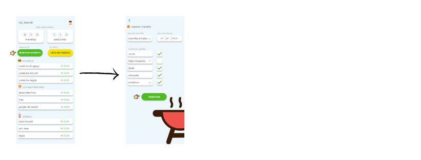

# Logo 

***

# Paleta de cores 

## Botões

## Logo

## Background

## Letras

***

# Fluxos

## Fluxos de login e cadastro

### Quando eu abro o aplicativo GregoApp eu quero:

 1) Navegar no aplicativo sem cadastro;  
 2) Entrar usando o meu número de celular e senha;  
 3) Criar conta (cadastrar) usando o número do celular;  
 4) Recuperar minha senha caso seja necessário;  

 Para que eu possa iniciar uma sessão no aplicativo.

 ###  Última atualização: *20/06/2019*  

  1) Quero entrar sem possuir cadastro.

  

  2) Quero me cadastrar.

  

  3) Quero entrar usando o meu telefone cadastrado.

  

***

## Fluxos de reserva e pedido 

### Quando eu entro no aplicativo GregoApp eu quero:

 1) Reservar a minha marmita;  
 2) Vizualizar a lista de todos os meus pedidos já feitos;  
 3) Vizualizar as guarnições que escolhi;  
 4) Pedir um sanduíche;  
 5) Vizualizar o meu pedido atual antes de a conta ser fechada;  
 6) Deletar um pedido já selecionado;

 Para que eu possa fazer o meu pedido de maneira mais ágil e controlada.

  ###  Última atualização: *22/06/2019*  

  1) Quero reservar minha marmita.

  

  2) Quero ver a minha lista de pedidos realizados.

  

  3) Quero ver novamente quais guarnições escolhi.

  

  4) Quero pedir um sanduíche.

  

  5) Quero vizualizar o meu pedido atual antes de a conta ser fechada.

  

  6) Quero poder deletar um pedido já selecionado.  

  