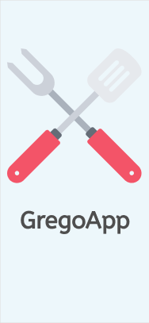

# Protótipo: Ideação de UX, UI e Design de interação

Neste documento, procura-se descrever o processo desde a motivação por trás da paleta de cores até a interação entre as telas apresentadas.

## UX e UI
O processo de UX seguiu alguns conceitos básicos, guiados primariamente pelo público alvo do app. Esses princípios foram:

* **Simplicidade**

  O app deve ser simples, tanto na navegação quanto na apresentação. Deve contemplar os produtos e as informações derivadas deste (estoque, preço etc) no menor espaço e maior clareza possíveis.  

  Essa decisão foi motivada pois seria contraintuitivo apresentar uma ferramenta que dificultasse uma interação informal e rápida como já existe hoje (pelo menos ao realizar os pedidos em horarios mais amenos). 

  A ideia também surgiu pois são pessoas que estão trabalhando e não possuem tempo/disponibilidade para aprender uma ferramenta complexa - se tornando novamente contraintuiva.

* **Clareza nas informações** 
  
   As informações devem ser claras e concisas, levando em conta que são poucos produtos e o serviço oferecido é um só: venda de alimentos.

* **Velocidade na execução da funcionalidade** 

  O cliente quer comprar ou reservar o seu lanche/almoço, receber e ir embora. O Tio do Grego quer ter controle sobre o estoque e vender os seus lanches com facilidade. Atingindo um app simples e claro, atinge-se também a velocidade na interação.

A interface segue a mesma linha de raciocínio descrita pela UX. Procurou-se o menor número de interações possível relacionada à *inputs* de texto: a maior parte da interação se dá através de botões. 

Nas situações onde é requisitado inputs de texto, são em momentos específicos onde é necessário saber os dados necessários para prosseguir: nome, telefone e senha no cadastro ou apenas o nome quando o usuário prosseguir sem o cadastro.

A decisão de habilitar um fluxo sem o cadastro é motivado para atrair o usuário a utilizar o app e retirar uma barreira. Caso ele opte por essa opção, ao fechar uma reserva ou pedido no local, ele pode ser redirecionado para o cadastro - este já é um padrão de mercado bem utilizado em plataformas de *e-commerce*.

A decisão de colocar à vista do cliente a quantidade de sanduíches e marmitas restantes é para auxiliar na compra e programação daqueles alunos que precisam comprar em cima da hora e não darem viagem perdida ou precisarem contatar algum funcionário para conferir se ainda há estoque.

### Paleta de cores 
A paleta de cores seguiu uma ideia de cores quentes/pasteis para alguns itens mais pontuais, como os botões e a logo. A ideia surgiu de uma simplificação de uma paleta de cores com a temática de churrasco/alimentação que vimos ao buscar referências.

Também foram utilizadas cores frias/neutras para "quebrar" a intensidade das cores mais quentes.

Foi feito uso de ícones para compor cores cores em telas predominantemente mais "frias".

***

### Logo 

A logo escolhida foi uma espátula e um garfo, utensílios de cozinha utilizados na preparação dos pratos do Grego, churrasco e 

***

### Ícones 

Os icones escolhidos seguiram um padrão *flat*, aproveitando-se da ideia de simplicidade e informalidade da UX.

***

### Fonte e tamanhos

***

## Fluxos

#### Fluxos de login e cadastro

###### Quando eu abro o aplicativo GregoApp eu quero:

 1) Navegar no aplicativo sem cadastro;  
 2) Entrar usando o meu número de celular e senha;  
 3) Criar conta (cadastrar) usando o número do celular;  
 4) Recuperar minha senha caso seja necessário;  

 Para que eu possa iniciar uma sessão no aplicativo.

 Última atualização: *20/06/2019*  

  1) Quero entrar sem possuir cadastro.

  

  2) Quero me cadastrar.

  

  3) Quero entrar usando o meu telefone cadastrado.

  

***

#### Fluxos de reserva e pedido 

#### Quando eu entro no aplicativo GregoApp eu quero:

 1) Reservar a minha marmita;  
 2) Visualizar a lista de todos os meus pedidos já feitos;  
 3) Visualizar as guarnições que escolhi;  
 4) Pedir um sanduíche;  
 5) Visualizar o meu pedido atual antes de a conta ser fechada;  
 6) Deletar um pedido já selecionado;

 Para que eu possa fazer o meu pedido de maneira mais ágil e controlada.

Última atualização: *22/06/2019*  

  1) Quero reservar minha marmita.

  

  2) Quero ver a minha lista de pedidos realizados.

  

  3) Quero ver novamente quais guarnições escolhi.

  

  4) Quero pedir um sanduíche.

  

  5) Quero vizualizar o meu pedido atual antes de a conta ser fechada.

  

  6) Quero poder deletar um pedido já selecionado.  

  

## Referências de padrões e ferramentas 

* Figma: para design do protótipo de alta fidelidade.
* Pttrns: para padrões de projeto UI mobile.
* FlatIcons: para ícones gratuitos.
* GoogleFonts: para buscar e testar fontes que poderiam vir a ser utilizadas no app.